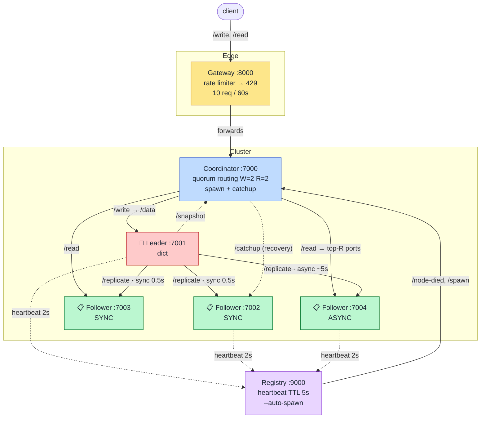

# Architecture — one component diagram per stage

**What this is.** A showable component diagram for **every stage of the `build-kvstore/` ladder
(01–10)** — the picture you put on screen so attendees can *see* the system grow one box at a time.
Every box, port, and arrow below is taken from the actual checkpoint code and from
[`tools/up.sh`](../tools/up.sh) (the canonical "what runs at stage NN"), not from memory.

Companion to [`slide-deck.md`](slide-deck.md) (which says *when* to show each one) and
[`motivating-incidents.md`](motivating-incidents.md) (the scar that motivates each new box). Pair them:
show the scar, then reveal the box that appears here.

> **Tip for the talk.** Keep the *same* canvas the whole session and **add one box per stage** — the
> emotional payoff is watching a single `dict` accrete into the full cluster. The "Full system at a
> glance" diagram at the bottom is your destination; the per-stage diagrams are the climb.

---

## Legend & conventions

```
┌────────┐
│  box   │  = one OS process (a uvicorn server), unless labelled { dict } (in-memory state)
└────────┘
  ───→      request / call           ⚡ NEW = the box this stage adds
  sync / async = replication paths   ⚠ = the pain this stage exposes (motivates the next)
  👑 leader   📋 follower             ✏️ = a file you write one line in
```

**Port map (consistent across the whole ladder — memorize it):**

| Stages | Component | Port(s) |
|---|---|---|
| 01–04 | node(s) | `:5001`, `:5002`, `:5003` |
| 05–10 | **coordinator** API | `:7000` |
| 05–10 | **leader** | `:7001` |
| 05–10 | **followers** | `:7002`, `:7003`, `:7004` (N=3) |
| 08–10 | **registry** | `:9000` |
| 10 | **gateway** (edge) | `:8000` |

**The subtraction story (call it out loud).** `load_balancer.py` and `rate_limiter.py` appear at
stages 03–04, then **leave** at stage 05 when we switch to the coordinator/cluster model — and
**return at stage 10**, now at the *edge* on the gateway. The load-balancing *responsibility* doesn't
vanish; it moves **server-side** into the coordinator's quorum routing.

---

## Stage 01 — Single node ·  *a dict behind HTTP*

```
                  ⚡ NEW: node.py
          ┌──────────────────────────┐
 client → │   node  :5001            │   POST /data         (write)
          │                          │   GET  /data/{key}   (read)
          │        { dict }          │
          └──────────────────────────┘
```

- **Flow:** client → node → in-memory `dict`. That's the entire data model.
- **Teaches:** a KV store is two routes over a dict (Redis's origin). The control variable for everything that follows.

---

## Stage 02 — Vertical scaling ·  *the single-thread ceiling*

```
                       ⚡ NEW: --workers N, --load-factor 30
          ┌─────────────────────────────────────────┐
 concurrent│   node  :5001                           │
   load  → │   ┌─────┬─────┬─────┬─────┐             │   each request runs
          │   │ w1  │ w2  │ w3  │ w4  │  worker procs│   simulate_cpu_load()
          │   └─────┴─────┴─────┴─────┘             │   first (CPU-bound)
          │              { dict }                    │
          └─────────────────────────────────────────┘
   4 workers → load spreads across cores.   ⚠ WORKERS=1 → requests queue behind the GIL.
```

- **Flow:** same node, now CPU-bound per request; multiple worker processes use multiple cores.
- **Teaches:** one thread (the GIL ≈ Redis's one command thread) is a hard ceiling. Fix = more workers. Demo the ceiling with `WORKERS=1 make lab STAGE=02`.

---

## Stage 03 — Horizontal scaling + load balancing ✏️ ·  *go wide, then route by capacity*

```
   RED  — round-robin is blind          GREEN — adaptive routes by capacity
                    ┌──────────────────────────────────┐
                    │  client.py                       │   ⚡ NEW: 3 nodes + load_balancer.py
   load  ─────────→ │  round_robin (blind)  |  ADAPTIVE│   round_robin → 1→2→3 (over-feeds weak)
                    │  AdaptiveStrategy.get_node()  ✏️ │   adaptive    → lowest-load node
                    └──────┬─────────┬─────────┬────────┘
                ┌──────────┘         │         └──────────┐
                ▼                    ▼                    ▼
       ┌────────────────┐  ┌────────────────┐  ┌────────────────┐
       │ node-1 :5001   │  │ node-2 :5002   │  │ node-3 :5003   │
       │ load 30 WEAK   │  │ load 25 strong │  │ load 25 strong │
       │ workers=1      │  │ workers=4      │  │ workers=4      │
       │   { dict A }   │  │   { dict B }   │  │   { dict C }   │
       └────────────────┘  └────────────────┘  └────────────────┘
   ⚠ three SEPARATE dicts → data is SPLIT (motivates replication, S05)
   round-robin over-feeds the weak node → bad p95;  adaptive routes AWAY from it → p95 drops.
```

- **Flow:** one box is a capacity wall *and* a SPOF → run several (horizontal scaling). The client
  routes across them through `load_balancer.py` selected with `--strategy`.
- **⚡ NEW box:** `load_balancer.py` (a strategy the client uses). You implement
  `AdaptiveStrategy.get_node` — return the lowest-load node.
- **Teaches:** going wide reveals two bills — **load balancing** (round-robin is blind to capacity →
  you pay it here with adaptive routing, spreading toward *capacity* not evenly: HAProxy `leastconn`
  / Envoy power-of-two) and **replication** (the dicts are split → paid at S05). The weak node's
  heavier per-request cost (load 30 vs 25) on one worker makes adaptive's win reproducible. Compare
  `nload round_robin 96 12` vs `nload adaptive 96 12`.

---

## Stage 04 — Rate limiting ✏️ ·  *when your own clients DDoS you*

```
          ┌─────────────────────────────────────────────────┐
  flood   │   node  :5001                                   │
  →→→→→→  │   ┌──────────────────────────────┐              │   ⚡ NEW: rate_limiter.py
          │   │ rate_limiter.py              │ ── over ──→ 429│   fixed window: 5 req / 10s
          │   │ FixedWindowStrategy          │   budget       │   is_allowed()  ✏️
          │   │ is_allowed()  (INCR+EXPIRE)  │              │
          │   └───────────────┬──────────────┘              │
          │                   ▼  allowed                    │
          │                { dict }                         │
          └─────────────────────────────────────────────────┘
   ⚠ back to ONE node — we've shielded traffic, but the data still lives on a single box.
```

- **⚡ NEW box:** `rate_limiter.py` — an intake valve **on the node**. Over budget → HTTP **429**. You implement the core of `is_allowed`.
- **Teaches:** floods are external (GitHub 1.35 Tbps) *and* self-inflicted (DynamoDB retry storm). Note the known fixed-window boundary-burst weakness. (This limiter **graduates to the gateway edge** at S10.)

---

## Stage 05 — Replication ✏️ ·  *the leader's only copy is the bug*

> **The big jump.** The client/node-and-strategy world is replaced by a **cluster**: a `coordinator`
> spawns a **leader** + **3 followers** as subprocesses. `load_balancer.py` and `rate_limiter.py`
> leave here (they return at S10). Stages 05–07 share this exact shape — only the **quorum** changes.

```
                       ⚡ NEW: coordinator.py  (spawns leader + 3 followers)
              ┌──────────────────────────────────────────────────┐
  client ───→ │  coordinator  :7000        W=1  R=1  (weak)       │
              │  /write → leader      /read → R followers (top ports)
              └──────┬───────────────────────────────────┬───────┘
              POST /data                            GET /data/{key}
                     ▼ (write)                            ▼ (read)
              ┌───────────────┐
              │ LEADER  :7001 │👑   ✏️ replicate_to_follower() → POST /replicate
              │   { dict }    │
              └──┬─────┬───────┘
        sync (smallest W)  async (~5s visible lag)
            ▼         ▼              ▼
   ┌─────────────┐ ┌─────────────┐ ┌─────────────┐
   │ foll. :7002 │ │ foll. :7003 │ │ foll. :7004 │  ◄── reads hit the largest-R ports
   │ 📋 SYNC     │ │ 📋 ASYNC    │ │ 📋 ASYNC    │
   └─────────────┘ └─────────────┘ └─────────────┘
   ⚠ W=1,R=1: write syncs only :7002; reads hit :7004 (async, lagging) → STALE / stranded reads.
```

- **⚡ NEW box:** `coordinator.py`. You implement `replicate_to_follower` (leader POSTs `/replicate`).
- **Key design:** **reads are served by followers**, so a write that fails to replicate is *invisible* — the GitLab "stranded copy" lesson. The coordinator picks sync followers = smallest-W ports, read followers = largest-R ports (overlap engineered by port order — a teaching device).

---

## Stage 06 — Synchronous replication ·  *no stale reads (W = N)*

Same cluster as S05; **only the quorum knob changes** → `W=3, R=1`.

```
   coordinator :7000   W=3  R=1            LEADER :7001 👑
        │                                       │ /replicate (ALL sync, fast 0.5s)
        │ /write ── waits for all 3 acks ──→ ┌───┴───┬───────┬───────┐
        │                                    ▼       ▼       ▼
        │  /read → :7004                 :7002    :7003    :7004
        ▼                                 SYNC     SYNC     SYNC ◄ read
   ┌─────────────────────────────────────────────────────────────┐
   │  W + R = 3 + 1 = 4  >  N = 3   ⇒  sync set ∩ read set ≠ ∅    │  ⇒ reads always fresh
   └─────────────────────────────────────────────────────────────┘
   ⚠ "write to everyone" ⇒ a write now needs EVERY follower alive — zero fault budget (→ S07).
```

- **Teaches:** make every follower synchronous → stale reads vanish ("write to everyone ⇒ read from anyone"). Strong but blunt.
- **No new box** — a config change. The overlap strip is the visual: the read port is now inside the (all-3) sync set.

---

## Stage 07 — Quorum & fault tolerance ·  *the CAP choice, live (W=2, R=2)*

Same cluster; **majority quorum** → `W=2, R=2`, `N=3`.

```
   coordinator :7000   W=2  R=2            LEADER :7001 👑
        │                                       │ /replicate
        │ /write ── waits for 2 acks ──→ ┌───────┼───────┐
        │                                ▼       ▼       ▼ (async)
        │  /read → top 2 ports        :7002    :7003    :7004
        ▼                              SYNC     SYNC      ·
        │                                ·    ◄─read─►   ◄─read
   ┌─────────────────────────────────────────────────────────────┐
   │  sync set {7002,7003}   read set {7004,7003}   OVERLAP @7003 │
   │  W + R = 2 + 2 = 4 > N = 3  ⇒ fresh  AND  survives ⌊N/2⌋ = 1 │
   └─────────────────────────────────────────────────────────────┘
   ⚡ CAP moment: kill a follower → quorum still holds (writes succeed). Drop below quorum →
     coordinator returns 503 (refuse writes to stay consistent — the CP corner) while reads still serve.
```

- **Teaches:** `W + R > N` is the spine — fresh reads *and* tolerate one failure. Tune `W` along the CAP spectrum.
- **Caveat to say:** this is a Dynamo-style `W+R>N` *rule* on a *single-leader* system, overlap engineered by port ordering. Pedagogically clean; not how Cassandra/DynamoDB actually coordinate.

---

## Stage 08 — Service discovery ✏️ ·  *heartbeats detect death*

```
                         ⚡ NEW: registry.py  :9000   (heartbeat TTL = 5s)
                    ┌──────────────────────────────┐
                    │  registry  :9000             │  marks a node "dead" when
                    │  POST /heartbeat   /nodes     │  beats stop → POST /node-died
                    └───▲────▲────▲────────┬────────┘     to coordinator
       heartbeat every 2s│    │    │       │ /node-died
   ✏️ heartbeat_loop()   │    │    │       ▼
   ┌──────────────┐  ┌───┴──┐ │  ┌─┴────┐  ┌──────────────────────────┐
   │ LEADER :7001 │──┘      │ └──│ foll │  │  coordinator  :7000       │
   │     👑       │  ┌──────┴─┐  │ :7003│  │  (W=2, R=2, --registry)   │
   └──────────────┘  │ :7002  │  └──────┘  └──────────────────────────┘
                     └────────┘   :7004    (no --auto-spawn yet → manual recovery)
   ⚠ death is now DETECTED, but a dead follower stays dead — the cluster runs degraded (→ S09).
```

- **⚡ NEW box:** `registry.py`. You implement `heartbeat_loop` — each node POSTs `{node_id, port, url, role}` to `/heartbeat` every interval.
- **Teaches:** the nervous system (etcd/Consul/Eureka). Without it, the cluster can't recover from a death it never notices (Roblox's 73-hour blackout).

---

## Stage 09 — Auto-recovery ·  *the cluster heals itself*

Same as S08 + the registry now runs `--auto-spawn --spawn-delay 5`.

```
   registry :9000  ⚡ --auto-spawn          coordinator :7000
        │  ① beats stop → mark dead              │
        │  ② POST /spawn {node_id, port} ───────►│  ③ re-launch follower subprocess
        │                                         │  ④ GET /snapshot from leader
        │                                         ▼     POST /catchup to new follower
   ┌──────────────┐   /snapshot   ┌──────────────┐      ┌──────────────────────────┐
   │ LEADER :7001 │ ─────────────►│ coordinator  │ ───► │ revived follower :7002    │
   │     👑       │   full state  │  (catchup)   │ data │  📋 caught up, serving     │
   └──────────────┘               └──────────────┘      └──────────────────────────┘
   ✅ crash a follower → the registry detects the silence, respawns it AND catches it up from the leader's snapshot. No human.
```

- **No new box** — a registry flag plus the existing catchup path (coordinator `GET /snapshot` → `POST /catchup`).
- **Teaches:** recovery must be automatic (Netflix Chaos Monkey). The emotional high note.
- **Caveat to say:** this recovers **followers**, not the leader — promoting a follower is **leader election** (Raft/Sentinel), explicitly **out of scope**.

---

## Stage 10 — Full system ·  *the synthesis*

```
                       ⚡ NEW: gateway.py  :8000  (edge)
          ┌────────────────────────────────────────────┐
 client → │  GATEWAY  :8000                            │   rate_limiter.py RETURNS here
          │  rate-limit middleware → 429 (10 req/60s)   │   /write /read → coordinator
          └───────────────────────┬─────────────────────┘   (forwards to ONE coordinator —
                                  │ /write  /read              so it does NOT load-balance)
                                  ▼
          ┌────────────────────────────────────────────┐         ┌────────────────────┐
          │  coordinator  :7000   (W=2, R=2)           │◄───────►│  registry  :9000   │
          │  quorum routing  (this is where LB lives now)        │  heartbeats +      │
          └───────┬──────────────────────────┬─────────┘  /node-  │  --auto-spawn      │
            /data │                     /data/{key}        died    └─────────▲──────────┘
                  ▼ (write)                   ▼ (read)                       │ heartbeats
          ┌───────────────┐         ┌──────────────────────────────┐        │
          │ LEADER :7001  │👑──/replicate──►  followers :7002–:7004 │────────┘
          │   { dict }    │         │   📋 SYNC ×2   📋 ASYNC ×1     │
          └───────────────┘         └──────────────────────────────┘
   One request survives, in 2 minutes, every failure class from S01–S09.
```

- **⚡ NEW box:** `gateway.py` at the edge — and `rate_limiter.py` graduates from the node (S04) to the gateway.
- **No incident, no code** — it's the synthesis. Drive it live: `kvwrite`/`kvread` (trace the path), `kvflood` (429s at the edge), `kvkill 1` (quorum holds → auto-respawn + catchup → reads stay fresh).
- **Caveat to say:** the gateway forwards to a *single* coordinator, so it doesn't load-balance; that responsibility moved server-side into the coordinator's quorum. In production you'd run several coordinators behind the gateway.

---

## Full system at a glance (the destination)

```
   client
     │
     ▼
   ┌─────────────────────┐   429 ◄ rate limiter (edge)
   │  GATEWAY    :8000   │
   └─────────┬───────────┘
             │ forwards /write, /read
             ▼
   ┌─────────────────────┐        /node-died, /spawn      ┌─────────────────────┐
   │  COORDINATOR :7000  │ ◄───────────────────────────►  │  REGISTRY   :9000   │
   │  quorum W=2 R=2     │                                 │  heartbeat TTL 5s   │
   │  spawns + catchup   │                                 │  --auto-spawn       │
   └───┬─────────────────┘                                 └──────────▲──────────┘
       │ /write→leader   /read→followers                              │ heartbeats (every 2s)
       ▼                                                              │
   ┌──────────────┐   /replicate (sync ×W, async rest)    ┌───────────┴───────────┐
   │ LEADER :7001 │👑 ───────────────────────────────────►│ FOLLOWERS :7002–:7004  │
   │   { dict }   │   /snapshot ──► coordinator ──► /catchup│ 📋 read-serving        │
   └──────────────┘                                        └───────────────────────┘

   Quorum invariant:  W + R > N  ⇒  read set ∩ write set ≠ ∅  ⇒  no stale reads.
```

### Mermaid version (renders as a graphic on GitHub / many slide tools)

Same topology as the ASCII diagram above — use whichever your display renders. Solid = request/data
path; dotted = recovery (snapshot/catchup) and heartbeats.



> **Quorum invariant:** `W + R > N` ⇒ read set ∩ write set ≠ ∅ ⇒ no stale reads. With W=2, R=2, N=3:
> sync set `{7002,7003}` and read set `{7004,7003}` overlap at `7003`. (Heartbeat edges from `:7003`
> omitted above purely to reduce clutter — every node heartbeats the registry.)

| Layer | Port | Built in | Real-world analog |
|---|---|---|---|
| Gateway + rate limiter | `:8000` | S04 (limiter) + S10 (edge) | Cloudflare / API Gateway |
| Coordinator (quorum routing) | `:7000` | S05–S07 | Cassandra coordinator / `mongos` |
| Leader | `:7001` | S05 | Redis primary / PG primary |
| Followers ×3 | `:7002–:7004` | S05 | read replicas / ISR |
| Registry (heartbeats + auto-spawn) | `:9000` | S08–S09 | etcd / Consul / Eureka |

> Command for any stage's live view: `make lab STAGE=NN`. Per-stage launch detail:
> [`tools/up.sh`](../tools/up.sh). Narration & timing: [`slide-deck.md`](slide-deck.md).
